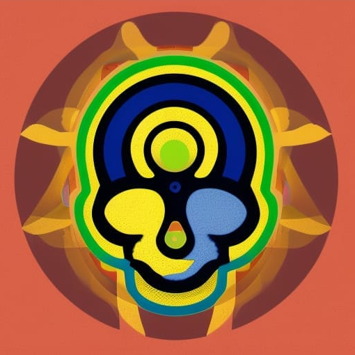

===========
Neuro Utils
===========

.. start-badges

.. list-table::
    :stub-columns: 1

    * - Documentation
      - |docs|
    * - Code
      - | |made-with-python| |code-style| |imports|
        | |pre-commit|
    * - Tests
      - | |github-actions| |codecov|
        | |code-quality|
    * - Packaging
      - | |version|

.. |docs| image:: https://readthedocs.org/projects/neuro-utils/badge/?style=flat
    :target: https://neuro-utils.readthedocs.io
    :alt: Documentation Status

.. |made-with-python| image:: https://img.shields.io/badge/Made%20with%20Python-v3.9-blue.svg?style=flat
    :target: https://www.python.org/
    :alt: Made with Python

.. |code-style| image:: https://img.shields.io/badge/code%20style-black-000000.svg
    :target: https://github.com/psf/black
    :alt: Code style

.. |imports| image:: https://img.shields.io/badge/%20imports-isort-%231674b1?style=flat&labelColor=ef8336
    :target: https://pycqa.github.io/isort/
    :alt: Imports

.. |pre-commit| image:: https://img.shields.io/badge/pre--commit-enabled-brightgreen?logo=pre-commit&logoColor=white
    :target: https://pre-commit.com/
    :alt: Pre-commit

.. |code-quality| image:: https://app.codacy.com/project/badge/Grade/b31cb38534da448b9833b0ac2e1f4327
    :target: https://www.codacy.com/gh/GalKepler/neuro_utils/dashboard?utm_source=github.com&amp;utm_medium=referral&amp;utm_content=GalKepler/neuro_utils&amp;utm_campaign=Badge_Grade
    :alt: Code quality

.. |github-actions| image:: https://github.com/GalKepler/neuro_utils/actions/workflows/major_ci_workflow.yml/badge.svg
    :alt: GitHub Actions Build Status
    :target: https://github.com/GalKepler/neuro_utils/actions

.. |codecov| image:: https://codecov.io/gh/GalKepler/neuro_utils/branch/main/graph/badge.svg?token=NAVXSZMD5L
    :alt: Coverage Status
    :target: https://codecov.io/gh/GalKepler/neuro_utils

.. |version| image:: https://badge.fury.io/py/neuro_utils.svg
    :alt: PyPI Package latest release
    :target: https://pypi.org/project/neuro_utils

A python package aimed at making neuroimaging studies easier to analyse.

* Free software: MIT license
* Documentation: https://neuro-utils.readthedocs.io.

Features
--------

* TODO

Credits
-------

This package was created with Cookiecutter_ and the `audreyr/cookiecutter-pypackage`_ project template.

.. _Cookiecutter: https://github.com/audreyr/cookiecutter
.. _`audreyr/cookiecutter-pypackage`: https://github.com/audreyr/cookiecutter-pypackage
